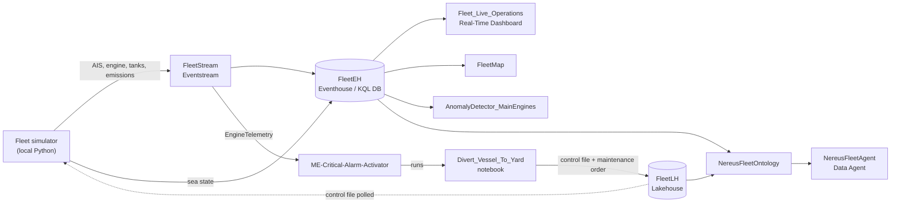

# Fabric Maritime RTI + Ontology Demo

End-to-end **Microsoft Fabric** demo for the **shipping / tanker industry**: live fleet telemetry with **Real-Time Intelligence**, automated response with **Activator**, anomaly detection, and an **Ontology-grounded Data Agent** – all deployable into an empty workspace with one script.

The story follows **Nereus Tankers S.A.**, a *fictional* Athens-based operator of 8 crude and product tankers trading in the Eastern Mediterranean and the Adriatic. Every vessel streams AIS position, main-engine, cargo-tank and emissions telemetry; Fabric turns that stream into a live operations picture, an automatic response to a main-engine failure, and a data agent you can ask questions in plain English.

> **Acknowledgement** – This repository is based on **George Alexiou**'s excellent [**fabric-energy-rti-ontology**](https://github.com/galex87/fabric-energy-rti-ontology) demo (energy sector: wind, solar, grid). The overall architecture – simulator → Eventstream → Eventhouse → Real-Time Dashboard, an Activator rule that runs a Fabric notebook to dispatch an asset via lakehouse control files, the Anomaly Detector, and an Ontology-grounded Data Agent – is his design. This repo re-builds that pattern **with a focus on shipping**: a new maritime domain model, simulator, dashboards, ontology, agent instructions and a REST-based deployer. Thank you, George!

---

## What the demo shows

| Act | Fabric capability | What the audience sees |
|---|---|---|
| 1 | **Eventstream + Eventhouse + Real-Time Dashboard** | 8 tankers live on a map; fleet status, engine health, fuel burn, sea state – refreshed every few seconds. |
| 2 | **Activator** (reactive) | A main-engine critical alarm on *NT Ariadne* is detected on the stream; Activator runs a notebook that **diverts the vessel to the Perama repair zone** and opens a **Critical maintenance order** – no human in the loop. |
| 3 | **Emissions & compliance** | Per-voyage CO₂, **IMO CII** attained vs required with A–E rating, and **EU ETS** allowance exposure (100 % / 50 % / 0 % scope). |
| 4 | **KQL native ML + Anomaly Detector** (predictive) | *NT Kallisto*'s turbocharger vibration slowly drifts from its own baseline and is flagged **before** it fails; *NT Nefeli* COT 3S inert-gas O₂ creeps toward the 8 % SOLAS limit. |
| 5 | **Ontology + Data Agent** | A business model of Vessel, MainEngine, CargoTank, Voyage, Port, Charterer, MaintenanceOrder and EmissionsRecord – static Lakehouse data and live Eventhouse telemetry on the same entity – queried in natural language. |

A presenter talk track is in [docs/DEMO_SCRIPT.md](docs/DEMO_SCRIPT.md) and tested agent prompts are in [docs/PROMPTS.md](docs/PROMPTS.md).

## Architecture



### Fabric items created

| Item | Type | Purpose |
|---|---|---|
| `FleetLH` | Lakehouse | Reference data: vessels, main engines, ports, charterers, voyages, cargo tanks, maintenance orders, emissions ledger (8 Delta tables) + demo control files |
| `FleetEH` | Eventhouse / KQL DB | Live tables `VesselPositions`, `EngineTelemetry`, `CargoTankTelemetry`, `WeatherTelemetry`, `EmissionsStream` + helper functions |
| `FleetStream` | Eventstream | Custom endpoint → per-stream filters → Eventhouse tables, plus engine stream → Activator |
| `Fleet_Live_Operations` | Real-Time Dashboard | 5 pages: Fleet Overview, Main Engines, Cargo & Safety, Emissions & Compliance, Weather & Sea State (25 tiles) |
| `FleetMap` | Map | Live vessels, ports & repair yards, sea areas |
| `ME-Critical-Alarm-Activator` | Activator | Fires when `EngineTelemetry.fault_type` changes to `ME_CRITICAL_ALARM`, runs `Divert_Vessel_To_Yard` |
| `AnomalyDetector_MainEngines` | Anomaly Detector | Turbocharger vibration per vessel |
| `NereusFleetOntology` | Ontology (+ auto-generated graph) | 8 entity types, 9 relationships, hybrid Lakehouse + Eventhouse bindings |
| `NereusFleetAgent` | Data Agent | Fleet-operations analyst grounded on the ontology |
| `00_Load_Reference_Data`, `Divert_Vessel_To_Yard`, `Demo_Trigger_Console`, `Fleet_Simulator` | Notebooks | Setup, automated response, manual trigger, optional in-Fabric simulator |

## Scenario details

- **Fleet**: 3 × Suezmax, 3 × Aframax, 1 × LR2 and 1 × MR tanker with realistic DWT, class societies and MAN B&W / WinGD main engines.
- **Routes** (shortest path over an at-sea lane graph): Augusta ↔ Ceyhan, Sidi Kerir ↔ Trieste, Port Said ↔ Aspropyrgos, Aspropyrgos ↔ Limassol, Es Sider ↔ Trieste, Ceyhan ↔ Trieste, Piraeus ↔ Augusta, Port Said ↔ Augusta. Vessels load, sail laden, discharge and return in ballast.
- **Time**: accelerated ×90 so vessels visibly move; the diverted vessel gets an extra boost so the demo lands in minutes.
- **Scripted stories**: *NT Ariadne* main-engine failure (on trigger), *NT Kallisto* turbocharger bearing wear (cyclic), *NT Nefeli* COT 3S inert-gas O₂ rising, random turbocharger spikes on two vessels.
- **Compliance maths**: CO₂ = fuel × 3.114 (VLSFO); CII attained = CO₂ × 10⁶ / (DWT × distance); EU ETS scope by EU / non-EU port pair; EUA price parameterised.

All names, vessels, companies and people in the data are fictional.

## Prerequisites

- A **Fabric capacity** (F2 or larger, or a trial) and Contributor+ rights to create a workspace on it.
- Tenant settings enabled for **Fabric Data Agent**, **Ontology / Graph** and **Anomaly Detector (preview)** (can take up to an hour to apply).
- **Azure CLI** signed in to the tenant (`az login`); the scripts use `az account get-access-token`.
- **Python 3.10+** with `pip install azure-eventhub requests`.
- **PowerShell 7** for `demo-control.ps1`.

## Setup

```powershell
# 1. Configure
Copy-Item config.example.json config.json   # fill in capacityId (and optionally subscription / workspaceName)

# 2. (Optional) regenerate the reference CSVs in data/
python src/gen_data.py

# 3. Deploy everything into a new workspace (~15 min; resumable - re-run any step by name)
python src/deploy.py
#   steps: infra kql data notebooks stream sim setup dashboard map anomaly ontology agent
#   e.g.   python src/deploy.py dashboard ontology
```

Then finish **two portal steps** (not exposed through the public API today):

1. **Data Agent source** – open `NereusFleetAgent` → **+ Data source** → pick **`NereusFleetOntology`** (type *Ontology*, not the auto-created `_lh_` Lakehouse or `_graph_` item) → **Add** → **Publish**. The agent instructions are pre-loaded.
2. **Eventhouse Python plugin** (for the Anomaly Detector) – open the `FleetEH` **Eventhouse** → **Plugins** → **Python language extension: On** → image **Python 3.11.7 DL** → **Done**.

## Running the demo

```powershell
./demo-control.ps1 start     # start the local simulator (data on the dashboard in ~20 s)
./demo-control.ps1 status    # simulator state + latest vessel positions
./demo-control.ps1 trigger   # inject the NT Ariadne main-engine critical alarm
./demo-control.ps1 reset     # stop, reload reference data (removes demo maintenance orders), restart
./demo-control.ps1 stop
```

Timeline after `trigger`: alarm on the dashboard in ~20–30 s → Activator starts `Divert_Vessel_To_Yard` after ~3 min → vessel shows **Diverted – Engine Repair** heading for Perama. Fill the gap with the Emissions & Compliance page. The trigger works once per simulator run – `reset` (or `stop` + `start`) before presenting again.

## Troubleshooting

| Symptom | Cause / fix |
|---|---|
| Dashboard *failed to load*, KQL returns **"Too many requests … throttling"** | Capacity overload. Don't run the Spark simulator (`start-spark`) on small capacities for long – it holds a whole Spark session. Use the local simulator. To clear throttling immediately, pause and resume the capacity in the Azure portal (accumulated overage is billed). |
| No new rows after a capacity pause/resume | Eventstream nodes stay **Paused**. Resume them: `POST /v1/workspaces/{ws}/eventstreams/{es}/resume` with body `{"startType":"Now"}`. |
| Eventstream node stuck in *Creating* / `ESComponentCreationFailure` | Transient platform error. Delete and re-create the Eventstream (`python src/deploy.py stream sim`). |
| Anomaly Detector: *The Python plugin is disabled* | Enable the Eventhouse Python plugin (portal step 2). |
| Data Agent has no answers / no sources | Add the ontology as its data source (portal step 1) and keep the simulator running for live values. |

## Repository layout

```
├── config.example.json        # capacity / subscription / workspace name
├── demo-control.ps1           # start | stop | status | trigger | reset
├── data/                      # reference CSVs (generated by src/gen_data.py)
├── docs/
│   ├── DEMO_SCRIPT.md         # presenter talk track (customer-agnostic)
│   └── PROMPTS.md             # Data Agent prompts
└── src/
    ├── model.py               # fleet, ports, charterers, sea-lane graph, routing
    ├── sim_core.py            # telemetry generators + send loop (shared by local runner and Fabric notebook)
    ├── local_sim.py           # local runner + instant trigger (no Fabric capacity used)
    ├── gen_data.py            # reference data generator
    ├── deploy.py              # REST deployer for all Fabric items
    └── templates/             # Fabric-generated item templates (see templates/README.md)
```

## Disclaimer

This is a community demo, not an official Microsoft product or reference architecture. Several items it uses (Ontology, Data Agent, Anomaly Detector, Map) are in preview and their definitions may change. Nereus Tankers and all data are fictional.
